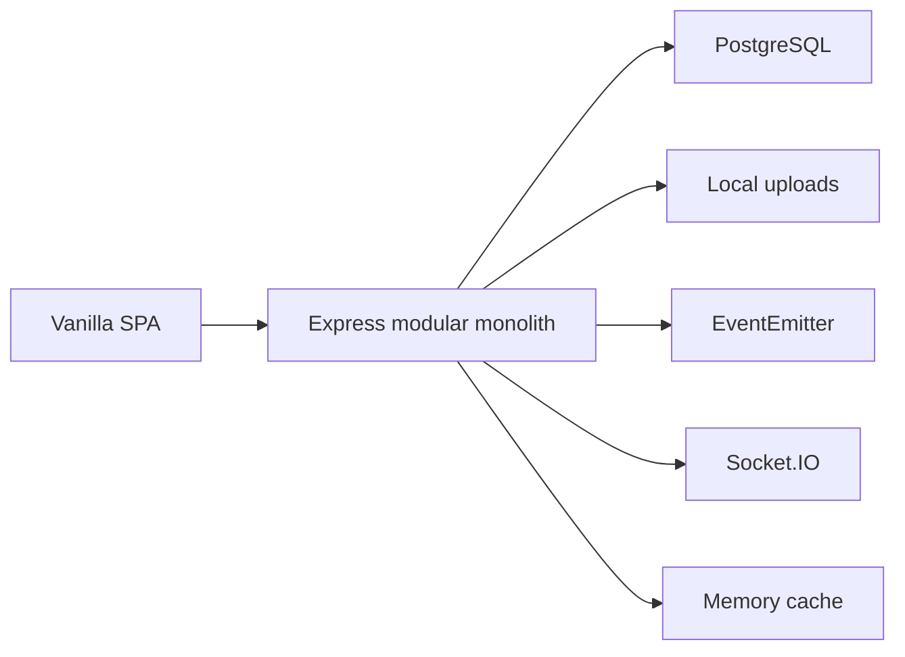
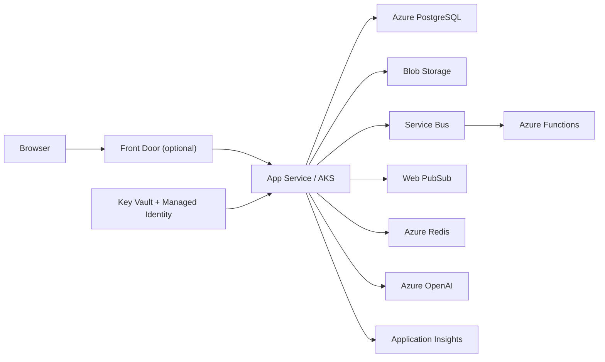
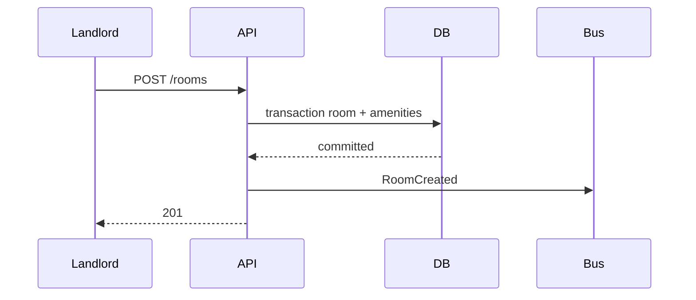
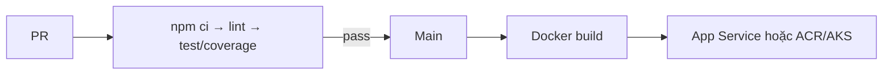

# Kiến trúc

## Local

## Cloud

Controller không biết provider cụ thể. Factory chọn implementation bằng biến môi trường. Azure matching tự fallback về rule-based khi lỗi.

## Luồng đăng phòng

Nếu publish lỗi, room đã commit không rollback và lỗi được ghi log.

## Upload ảnh

Client → Multer memory (MIME/size/count) → MediaService kiểm quyền → StorageProvider → metadata PostgreSQL. Azure chỉ thay provider.

## Matching

Profile → lọc chính mình/locked/not-looking → MatchingProvider → 10 tiêu chí trọng số 100 → lưu snapshot → sắp giảm dần → giải thích tiếng Việt.

## Chat và notification

REST/Socket.IO xác thực JWT → kiểm tra conversation member → lưu message → broadcast room → tạo notification người nhận → cập nhật unread/read state.

## CI/CD

